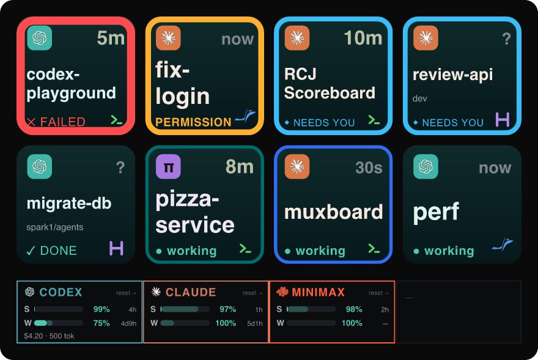
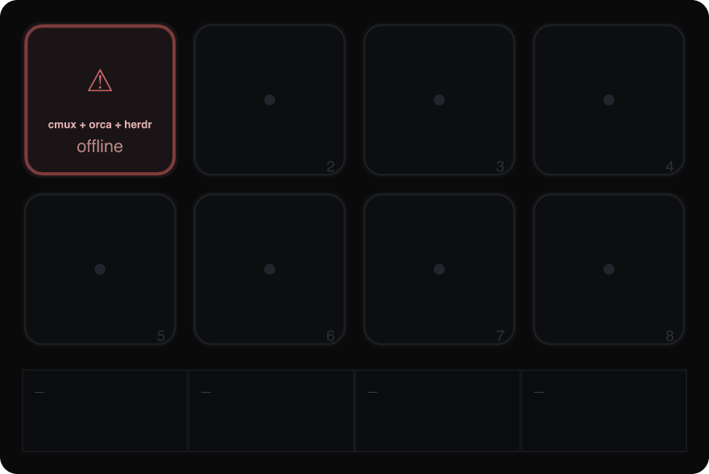

# Muxboard: a Stream Deck+ dashboard for AI coding agents

> Your [cmux](https://cmux.com/), [Orca](https://onorca.dev), and
> [Herdr](https://herdr.dev) coding agents on the keys, with CodexBar quotas,
> spend, and credits on the LCD.




*Agent glyphs appear at the top left and source badges at the bottom right.
`?` means the source's state age is not yet known.*

Muxboard turns the 8 keys of an Elgato Stream Deck+ into a shared queue of
[cmux](https://cmux.com/) panes, [Orca](https://onorca.dev) worktrees, and
[Herdr](https://herdr.dev) sessions whose coding agents (Claude Code, Codex, Pi,
[OMP](https://github.com/can1357/oh-my-pi), or any other) are working, waiting,
blocked, failed, or have unread results. Agents needing you stay up front.
Each key shows its state, age, and source, and pressing it reveals the existing
workspace or pane. Orca and Herdr are auto-detected, and Herdr includes named
local sessions and saved SSH machines (see [Orca support](#orca-support) and
[Herdr support](#herdr-support)). The LCD touch strip shows usage for every
enabled CodexBar provider, including Codex, Claude, MiniMax, Kimi, CommandCode,
and Perplexity: session and weekly quotas with reset countdowns and pace,
today's spend and tokens when available, and credit usage and allowances.
CommandCode can show rolling quotas alongside its monthly grant. Credit-only
accounts and Perplexity use a credit gauge.

[Install](#install) · [Controls](#how-it-works) · [Sources](#sources) ·
[Configuration](#configuration) · [Troubleshooting](#troubleshooting) ·
[Build from source](#build-from-source)

## Install

You need macOS, Node.js ≥ 20, a Stream Deck+, the
[Elgato Stream Deck app](https://www.elgato.com/stream-deck), and at least one
attention source: cmux, Orca, or Herdr. CodexBar is optional for the LCD.

The packaged [v0.2.0 release](https://github.com/mrshu/muxboard/releases/tag/v0.2.0)
includes cmux, Orca, Herdr, and the controls described here. To customize the
plugin, [build from source](#build-from-source).

To install the latest packaged release:

```bash
curl -fsSL https://raw.githubusercontent.com/mrshu/muxboard/main/scripts/setup.sh | bash
```

The installer opens the plugin package for confirmation, attempts to install
the bundled 8-key + 4-dial profile, and checks cmux automation mode when cmux is
present. Connect your device and open Stream Deck once before installing so
its device profile exists. Then select **Muxboard** in the profile dropdown.
If automatic profile installation is skipped, see [Troubleshooting](#troubleshooting).

## How it works

| Surface | Shows | Source |
| --- | --- | --- |
| 8 keys | Agent, status, workspace, age, and source badge | [cmux](#cmux-support), [Orca](#orca-support), [Herdr](#herdr-support) |
| LCD touch strip | Quotas, resets, pace, spend, tokens, and credits | [CodexBar](#codexbar-support) |
| 4 dials | Queue scrolling, agent/source filters, quota view, refresh | See [Dials](#dials-stream-deck) |

The keys fill left-to-right, top-to-bottom. Urgent items come first: failed,
permission, needs-input, stalled, then other waiting/results, with working
agents at the end. Items are newest-first within each priority band.

```text
1 2 3 4      key 1 = first item in the triage queue
5 6 7 8      key 8 = eighth item, or the overflow pager
```

When more than eight items match, seven agents and a **+N more** key appear.
Tap that key to page forward. **↑ top** returns to the start. Dial 1 scrolls the
queue directly. Empty slots render muted. **Decisions** shows only failures,
permission requests, and agents explicitly needing input.

- Tapping a key focuses its source: cmux opens the notification's workspace and
  surface, Orca selects the worktree's terminal, and Herdr reveals the existing
  session in its current host before focusing the selected agent. Herdr resolves
  direct terminal windows, Zellij, tmux, and cmux hosts without launching a new
  terminal. Each Herdr agent has an independent key, even in the same workspace.
- Long-pressing an attention key (hold ~0.6s) snoozes it locally for five
  minutes. It fires while you are still holding (you get a ✓). Releasing does
  nothing more. Muxboard leaves the backend notification intact, and the key
  returns automatically if it still needs attention. Working-only keys cannot
  be snoozed.
- The LCD shows one segment per CodexBar provider, auto-discovered from CodexBar
  rather than a hardcoded list. Each segment carries the provider name in
  CodexBar's brand color, the session and weekly gauges with their reset times,
  and a footer with today's spend and tokens when available. CommandCode can
  show its monthly grant alongside rolling quotas. Credit-only accounts and
  Perplexity show a credit gauge and a spend/allowance footer. Four providers
  are visible at once. Dial 4 rotates through any additional providers.
- Each gauge also carries a calm **pace** marker, comparing how much quota you've
  used against how far through the window the clock is: a faded same-hue
  extension toward where you "should" be when you're under the clock (in reserve,
  banking headroom), or a coral cap past it when you're over (in deficit). By
  default the row number is percent remaining. Rotating dial 3 flips it to the
  signed pace delta (`+12%` green = reserve, `−8%` coral = deficit).

### Dials (Stream Deck+)

| Dial | Turn | Short press / LCD tap | Hold (~0.6s) |
| --- | --- | --- | --- |
| 1 | Scroll queue (> 8 items) | Focus first visible item | Same as press |
| 2 | Cycle agent type | Clear both filters | Cycle source |
| 3 | Remaining % ↔ pace | Queue ↔ Decisions | Open CodexBar `/usage` |
| 4 | Scroll providers (> 4) | Refresh sources and quota | Same as press |

Agent cycle: **All → Claude → Codex → OMP → Pi**. Source cycle:
**All → cmux → Orca → Herdr**. Dial 4 leaves the LCD order unchanged when
four or fewer providers are enabled.

Agent type and source filters work together: select Claude, then hold dial 2
until Herdr is selected to show only Claude agents in Herdr. Release after each
hold to advance one source. Keys show **CMX**, **ORC**, or **HDR** while a source
is selected. Decisions adds **C DEC**, **O DEC**, or **H DEC**. Empty results
name the selected source. An unavailable source shows its own offline state
when no cached items match. Otherwise its last good tiles remain visible.
A short press or a touch on dial 2 clears both filters.

Each source keeps its last good data during an outage, and other sources keep
working when cmux, Orca, Herdr, or CodexBar is unreachable.

<details>
<summary>Offline dashboard preview</summary>



</details>

## Requirements

- **Device:** Stream Deck+ and the Elgato Stream Deck desktop app, which launches
  the plugin process. Node.js ≥ 20 is needed for the installer. Use ≥ 22 for
  development and tests.
- **Attention:** at least one running source. Keep the relevant CLI on `PATH`:
  `cmux`, `orca`, or `herdr`. Orca needs a reachable runtime (`orca status`).
  Herdr needs a running local session or enabled saved SSH machine.
- **cmux only:** enable Settings → Automation → Socket Control Mode →
  **Automation**, then fully quit and relaunch cmux. Verify with
  `cmux capabilities | grep access_mode`. For live state, install agent hooks
  as described in [cmux support](#cmux-support).
- **Herdr focus:** keep an existing client attached to the target session or
  saved machine. macOS must allow the window inspection and foregrounding
  requested through System Events. See [focus permissions](docs/herdr.md#macos-focus-permissions).
- **LCD:** install CodexBar and keep its HTTP server running on port 17777.
  The keys work without it. See [CodexBar support](#codexbar-support).

## Sources

### cmux support

Muxboard combines `cmux list-notifications --json` with workspace status,
agent hooks, and process activity. It shows one key per workspace, keeps read
notifications at reduced urgency, and honors explicit notification clears.
Actively working agents can appear even without a notification.

Enable cmux automation mode as described in [Requirements](#requirements).
For accurate live state, use cmux's Claude wrapper or `cmux hooks setup` for
other agents. OMP needs `cmux hooks omp install` (cmux ≥ 0.64.17). If Claude
states stay stale while Codex works, check the
[hook troubleshooting guide](docs/cmux.md#troubleshooting-agent-hooks).

See the [cmux integration guide](docs/cmux.md) for notification fields, agent
identification, state and age signals, and automation details.

### Orca support

Muxboard polls `orca worktree ps --json` and shows one key per worktree.
`waiting`/`blocked` agents show as needs-input, and `working` sinks to the end.
`done` shows a finished result (or failed when interrupted), only while the
worktree is **unread** so an already-seen result does not linger.
The Orca mark on each key distinguishes it from the cmux and Herdr sources.

Orca is **auto-detected** when its runtime is reachable (`orca status`).
Advanced settings `enableOrca`, `orcaBin`, and `orcaPollMs` control detection,
the binary path, and cadence. See [Configuration](#configuration).

Pressing an Orca key brings Orca forward and jumps to the worktree's most
recent terminal (`orca terminal focus`). Long-pressing an attention
key snoozes it locally for five minutes without changing Orca's unread state.
For the state-field distinction, see [Orca agent state](docs/development.md#orca-agent-state).

### Herdr support

Muxboard auto-detects **all running local sessions**, including named sessions,
and **enabled saved SSH machines**. Each terminal needing attention or actively
working gets its own key, even when several agents share a workspace. An **H**
badge and machine/session label identify it.

`working` sinks to the end, `blocked` shows **NEEDS YOU**, and `done` surfaces an
unseen result. Already-seen `idle` agents are omitted. While a terminal remains
completed, viewing a sibling does not clear its unread result observed by
Muxboard. Focusing its own key acknowledges it. On startup, native `idle` is
accepted as seen, including on servers retaining `completion_seq`.

Pressing a key reveals the **existing host**—a direct terminal, Zellij, tmux,
or cmux—and focuses the selected agent. It discovers the owning application
rather than assuming a particular terminal. A remote client must already be
attached to the matching saved machine. An ambiguous or missing host produces
an alert and leaves the item pending.

Remote snapshots refresh independently every 15 seconds by default, retaining
cached tiles during failures. Muxboard does not start stopped sessions or prompt
for SSH authentication. Herdr 0.9.0 servers are supported without restarting
existing sessions. The CLI/server integration suite is exercised with 0.9.3.

See the [Herdr integration guide](docs/herdr.md) for session/machine allow-lists,
completion history, age tracking, host discovery, and compatibility details.

### CodexBar support

The LCD discovers enabled providers from `codexbar serve`. It is not limited to
Codex and Claude. Four providers fit at once, and dial 4 scrolls any extras.
It shows session/weekly quotas, resets, pace, today's spend and tokens where
available, and credit/grant usage. CommandCode can show rolling quotas plus a
monthly grant. Credit-only accounts and Perplexity use a credit gauge.

Keep the server running on port **17777** with the launchd installer, which
starts it at login and restarts it after crashes:

```bash
curl -fsSL https://raw.githubusercontent.com/mrshu/muxboard/main/scripts/install-codexbar-agent.sh | bash
```

The packaged installer offers this step when CodexBar is installed. From a
checkout, use `bash scripts/install-codexbar-agent.sh`. Set `CODEXBAR_PORT` to
change the port and match `codexbarBaseUrl`. Remove the agent with the same
script's `--uninstall` option.

See the [CodexBar integration guide](docs/codexbar.md) for provider payloads,
credit pools, cookie/session failures, and rate-limit troubleshooting.

## Configuration

These advanced settings have defaults in [src/config.ts](src/config.ts).
There is currently **no settings editor** in the Stream Deck property inspector.
Standard installs use the defaults. Source builds can
[change defaults and rebuild](docs/development.md#configuration-overrides).
Stored Stream Deck global settings take precedence and are read at plugin startup.
Poll intervals and timeouts below are in milliseconds.

| Field | Default | Notes |
| --- | --- | --- |
| `cmuxBin` | `"cmux"` | Binary path or name (spawned directly) |
| `codexbarBaseUrl` | `"http://127.0.0.1:17777"` | `codexbar serve --port 17777` base URL |
| `codexbarProviders` | `[]` | Optional allow-list/order. Empty = auto-discover all |
| `cmuxPollMs` | `1500` | cmux poll interval |
| `codexbarPollMs` | `45000` | CodexBar poll interval |
| `codexbarTimeoutMs` | `30000` | Per-request HTTP timeout |
| `agentAliases` | `{}` | Manual override (name substring → agent). Process detection is primary |
| `busyCpuPercent` | `40` | Workspace CPU% (from `cmux top`) at/above which a running command counts as "working" |
| `enableOrca` / `enableHerdr` | `"auto"` | Start each optional source when reachable. `true` forces polling, `false` disables it |
| `orcaBin` / `herdrBin` | `"orca"` / `"herdr"` | CLI binary path or name |
| `orcaPollMs` / `herdrPollMs` | `1500` | Optional source poll interval |
| `herdrSessions` | `[]` | Exact local session allow-list. Empty includes all running sessions |
| `herdrIncludeMachines` | `true` | Include enabled saved SSH machine profiles |
| `herdrMachines` | `[]` | Saved profile id/label allow-list. Empty includes enabled profiles |
| `herdrMachinePollMs` | `15000` | Separate, slower polling cadence for SSH machines |

## Troubleshooting

- **An agent is missing:** short-press dial 2 to clear source and agent filters,
  switch to Queue with dial 3, and check **+N more** for overflow. cmux needs a
  notification or live working signal. Orca uses primary-agent state and unread
  completion. Herdr shows working, blocked, or unread completion. Already-seen
  idle Herdr agents are intentionally omitted.
- Herdr keys are missing. Check `herdr session list --json` for running local
  sessions, `enableHerdr`, and the `herdrSessions` allow-list. Stopped sessions
  are outside the attention feed. For saved machines, check that the profile is
  enabled and included in `herdrMachines`. Authentication must be completed
  separately in a terminal with `herdr machine reconnect <profile-id>`.
- A Herdr key shows an alert without revealing the agent. Keep an existing
  Herdr client attached in a direct terminal, Zellij, tmux, or cmux.
  Muxboard refuses an ambiguous host match instead of choosing another window.
  For remote work, select the matching saved machine in that client. Muxboard
  focuses the containing tab before the agent pane for compatibility with
  Herdr 0.9.0 servers. Restarting a running session is not required. If logs
  report a macOS permission error, check
  [focus permissions](docs/herdr.md#macos-focus-permissions).
- Plugin won't start or crash-loops on first install. The Stream Deck app runs
  Node plugins with its own managed Node.js runtime, downloaded on demand. If
  it's missing (`NodeJS/manifest.json not found` in
  `~/Library/Logs/ElgatoStreamDeck/StreamDeck.log`), fully quit and relaunch the
  Stream Deck app so it fetches the runtime, then restart the plugin.
- LCD shows "CodexBar off", or every segment reads "stale". `codexbar serve`
  isn't answering: it's not running, has crashed, or `codexbarBaseUrl` doesn't
  match its port. "stale" means the strip has not received a non-offline poll
  update for more than 2× the poll interval. Check with
  `curl -s http://127.0.0.1:17777/health`. If it's dead, install the keep-alive so
  it can't stay down: see [CodexBar support](#codexbar-support)
  (status: `launchctl list | grep codexbar-serve`, logs: `/tmp/codexbar-serve.log`).
- Keys are blank or show "cmux offline". cmux is rejecting the plugin. Confirm
  `cmux capabilities | grep access_mode` reads `"automation"` (not `cmuxOnly`).
  If it still says `cmuxOnly`, the setting hasn't taken. Set Socket Control Mode
  to Automation and fully quit and relaunch cmux (a reload is not enough). The
  plugin log (`com.mrshu.muxboard.sdPlugin/logs/`) will show `broken pipe` when
  rejected.
- No Muxboard keys, or the profile is missing. Connect the device and open
  Stream Deck once. For a packaged install, rerun the installer and complete
  the profile step. From a checkout, run `npm run install-profile` with the app
  closed. Reopen Stream Deck and select Muxboard from the profile dropdown.
- A key is stuck on a stale state (wrong "waiting", or an age that won't move
  even though the agent is active). cmux's agent hook feed has gone quiet for
  that session, so Muxboard has no live signal and falls back to the last
  notification. Confirm it: `cmux events --limit 5` shows recent UI rows but no
  `agent.hook.*` while an agent works. See
  [hook troubleshooting](docs/cmux.md#troubleshooting-agent-hooks). The usual
  cause is a PATH issue where cmux's `claude` wrapper is shadowed.

## Build from source

Use Node.js ≥ 22 for the development commands, and open Stream Deck once with
your device connected before installing the profile.

```bash
git clone https://github.com/mrshu/muxboard.git
cd muxboard
npm ci
npm run build
npx streamdeck link com.mrshu.muxboard.sdPlugin
```

Fully quit Stream Deck, then install the profile:

```bash
npm run install-profile
```

Reopen Stream Deck and select **Muxboard**. Start your attention sources and,
for the LCD, install the [CodexBar keep-alive agent](#codexbar-support).

### Headless preview and checks

These commands run without the hardware or desktop app:

```bash
npm test
npm run typecheck
npm run validate
npm run preview
```

`npm run preview` rasterizes the same key and LCD SVGs used on the device to
`out/dashboard.png` and `out/dashboard-offline.png` using controlled fixtures.

See the [development guide](docs/development.md) for the watcher, architecture,
device profile format, and Herdr/Stream Deck integration test suites.

## Privacy & non-goals

- CodexBar connects to `127.0.0.1`, and enabled Herdr machine profiles use
  their saved SSH routes. SSH authentication never prompts from the plugin.
- No terminal buffer scraping. Attention comes from structured source snapshots.
  Host discovery reads selected process routing metadata and window titles.
- No destructive actions. Muxboard never dismisses cmux notifications, runs
  commands inside agents, or sends approve/deny input. It reads and focuses.
- No cloud and no database beyond plugin settings and an in-memory cache.

MVP intentionally excludes: command execution, approve/deny buttons, non-Stream
Deck+ devices.

## License

MIT
